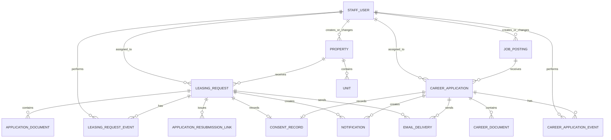

# RRC Operations MVP — Focused Implementation Plan

## First-release scope

The first Next.js release will focus only on these RRC workflows:

1. Renter applications
2. Viewing requests
3. Listing CMS and publishing controls
4. Staff accounts and permissions
5. Notifications, chime, and email delivery
6. Consent records and audit history
7. Careers/job postings and HR applications

Lease billing, payments, maintenance, and renter portal features remain outside this first release. Their current Prisma models remain untouched.

## Architecture decision for this release

Build this release as a Next.js and Tailwind admin/public experience backed by the existing Node/Fastify API, Prisma, and PostgreSQL database. Keep Prisma: it provides the typed database schema, safe migrations, and relationship handling needed for audit history, permissions, documents, and email delivery. This is a staged migration, not a database replacement: existing listing, leasing-request, document, and staff data must be preserved.

```text
Next.js public site + admin workspace
  → Node/Fastify API routes
  → service and audit layer
  → Prisma
  → PostgreSQL
```

## Roles

| Role | Main responsibility | Permissions |
|---|---|---|
| Super Admin | Full system administration | Manage all staff accounts, roles, listings, leasing, HR, settings, audit export |
| Admin | Property operations administration | Manage listings, review leasing requests, view audit trail; cannot create Super Admins |
| Leasing Manager | Leasing workflow owner | Review applications/viewings, change request status, request documents, send applicant messages |
| HR Manager | Careers workflow owner | Create, publish, unpublish, archive job postings; review job applications; send applicant messages |
| HR Staff | Careers support | Review assigned applications and add internal notes; no posting/account administration |
| Content Manager | CMS support | Draft/edit listings and images; submit for publishing; cannot manage staff or HR data |
| Auditor | Read-only control role | View audit history and permitted reports only |

`SUPER_ADMIN` remains the only role that can change staff roles or security configuration. Existing `LEASING` maps to Leasing Manager. Add `ADMIN`, `HR_MANAGER`, `HR_STAFF`, and `CONTENT_MANAGER` to the Prisma staff-role enum during the role migration.

## User journeys

### 1. Renter application

```text
Applicant chooses published listing
  → completes step-based form and consent
  → uploads supporting documents
  → submits application
  → applicant receives receipt email
  → Leasing Manager receives email + in-app notification + chime
  → Leasing Manager reviews / requests documents / updates status
  → applicant receives the appropriate status or resubmission email
```

### 2. Viewing request

```text
Visitor opens a published listing
  → submits preferred date/time with consent
  → receives receipt email saying the visit is pending confirmation
  → Leasing Manager receives email + in-app notification + chime
  → Leasing Manager updates schedule / closes request
  → visitor receives confirmed, changed, or unavailable email
```

### 3. Listing CMS

```text
Content Manager creates or edits a listing
  → saves Draft
  → Admin or Super Admin reviews
  → Publish / Unpublish / Archive action
  → audit event records who changed what and when
```

### 4. Career posting and review

```text
HR Manager creates job posting
  → saves Draft
  → Publish / Unpublish / Archive
  → applicant submits resume and consent
  → HR receives email + in-app notification + chime
  → HR reviews, changes status, and sends applicant message
```

## Application status model

| Status | Meaning | Applicant email |
|---|---|---|
| New | Submitted, awaiting staff review | Receipt/acknowledgement |
| In review | Leasing has opened the application | “We are reviewing” |
| Documents requested | More information is required | Secure resubmission link |
| Scheduled | Viewing schedule agreed | Schedule details |
| Approved | Staff approval completed | Approval/next-step message |
| Declined | Application will not proceed | Approved template, manual send only |
| Closed | Finished or withdrawn | Optional |

All status changes require a selected reason or staff note. Sensitive eligibility decisions must remain human-reviewed.

## Listing status model

| Status | Visible publicly? | Meaning |
|---|---:|---|
| Draft | No | CMS work in progress |
| Published | Yes | Available to browse and inquire about |
| Unpublished | No | Temporarily hidden, retained for editing |
| Archived | No | Historical listing; cannot receive new requests |

Use `archivedAt`, `archivedById`, `publishedAt`, and `publishedById` rather than deleting listings. Existing applications and audit history must always retain their property reference.

## Career posting status model

| Status | Visible publicly? | Meaning |
|---|---:|---|
| Draft | No | HR work in progress |
| Published | Yes | Accepting applications |
| Unpublished | No | Temporarily closed to public applications |
| Archived | No | Historic job post; no new applications |

## Database plan

### Keep as-is

- `StaffUser`, `StaffSession`, `AuditEvent`
- `Area`, `Property`, `Unit`, `PropertyImage`
- `LeasingRequest`, `ApplicationDocument`, `ApplicationResubmissionLink`
- `ApplicationUploadDraft`, `ApplicationDraftDocument`
- `Notification`

### Migration 1 — Staff roles, listings, and request history

Add or extend:

```text
StaffRole
  + ADMIN
  + HR_MANAGER
  + HR_STAFF
  + CONTENT_MANAGER

Property
  + status: DRAFT | PUBLISHED | UNPUBLISHED | ARCHIVED
  + publishedAt, publishedById
  + archivedAt, archivedById

LeasingRequest
  + assignedToId
  + consentId

LeasingRequestEvent
  id, requestId, actorId, eventType, previousStatus,
  nextStatus, note, metadata, createdAt
```

Retain `Property.isPublished` temporarily during migration, then replace it with `Property.status` after all reads are updated.

### Migration 2 — Consent and notification delivery

```text
ConsentRecord
  id, subjectType, subjectId, consentType, policyVersion,
  acceptedAt, ipAddress, userAgent

EmailDelivery
  id, relatedEntityType, relatedEntityId, templateKey,
  recipientEmail, status, providerMessageId, errorCode,
  queuedAt, sentAt, failedAt

Notification
  + entityType
  + entityId
  + priority
  + deliveredAt
```

Consent is captured before an application, viewing request, or career application is accepted. Store the policy version and timestamp, not merely a true/false form field.

### Migration 3 — Careers

```text
JobPosting
  id, reference, title, department, employmentType,
  location, description, requirements, status,
  opensAt, closesAt, publishedAt, archivedAt,
  createdById, updatedById, createdAt, updatedAt

CareerApplication
  id, jobPostingId, fullName, email, phone,
  coverNote, status, consentId, assignedToId,
  submittedAt, reviewedAt, createdAt, updatedAt

CareerDocument
  id, applicationId, kind, fileName, mimeType,
  storageKey, sizeBytes, submittedAt

CareerApplicationEvent
  id, applicationId, actorId, eventType,
  previousStatus, nextStatus, note, createdAt
```

Use `CareerDocument` for CV/resume and optional supporting files. Store documents privately and never attach them to ordinary status emails.

## Relationship map



## Notification and chime behavior

### In-app notifications

- Poll every 30 seconds initially; add Server-Sent Events later if needed.
- Admin header shows unread count.
- A chime plays only for a new, previously unseen high-priority event while the admin workspace is open.
- The browser must request user interaction/permission before sound is enabled.
- Clicking a notification marks it read and opens the correct request/application.
- Include an audio mute control stored per staff account or browser.

### Events that notify staff

| Event | Notify | Priority |
|---|---|---|
| New renter application | Leasing Manager + Admin | High |
| New viewing request | Leasing Manager + Admin | High |
| New resubmitted document | Assigned Leasing Manager + Admin | High |
| New career application | HR Manager + HR Staff | High |
| Listing awaiting publication | Admin + Content Manager | Normal |
| Failed email delivery | Responsible manager + Admin | High |

### Email rules

- Send staff and customer emails from the configured RRC leasing or HR mailbox.
- Log every send attempt in `EmailDelivery`.
- Do not claim a viewing is confirmed until staff selects a confirmed schedule.
- Do not put document bytes, passwords, or sensitive application data in email bodies.
- Use versioned templates: application receipt, review started, documents requested, viewing receipt, viewing confirmed, career receipt, and career status update.

## Audit trail rules

Write an immutable `AuditEvent` and entity-specific event for each of these actions:

- listing created, edited, published, unpublished, archived;
- price, rent, availability, unit, address, photo, or title changed;
- application/viewing/career application created, assigned, opened, status changed, or closed;
- document requested, uploaded, viewed, or deleted;
- email manually sent or delivery failed;
- staff account created, role changed, suspended, or password reset.

For price changes, store both the previous and new value in JSON metadata:

```json
{
  "field": "monthlyRent",
  "previous": "25000.00",
  "next": "27000.00",
  "reason": "Annual rate review"
}
```

The audit UI must show actor, date/time, entity, action, old value, new value, and reason. Audit records are never editable in the normal CMS.

## CMS pages

| Page | Key actions |
|---|---|
| Listings | Create, edit, image management, price/availability update, publish, unpublish, archive |
| Listing detail | History, current units, applications/viewings, public preview |
| Leasing queue | Filter, assign, review, status change, document request, email history |
| Careers | Create job post, edit, publish, unpublish, archive |
| Career applications | Filter, assign HR reviewer, view private CV, update status, email applicant |
| Notifications | Read/unread, open entity, mute chime setting |
| Staff accounts | Create, invite, role change, suspend/reactivate, session/security review |
| Audit | Filter by entity, actor, date, price change, publish/archival action |

## Implementation order

1. Add roles, `Property.status`, consent records, audit helpers, and notification/email delivery logging.
2. Build Next.js admin shell, staff login, notifications, chime settings, staff accounts, and audit viewer.
3. Build listing CMS with publish/unpublish/archive and price-change audit trail.
4. Build leasing queue, application/viewing detail, documents, resubmission, and outgoing email templates.
5. Build careers posting CMS and HR application workflow.
6. Add full integration tests, staging UAT, backup verification, and controlled production cutover.

## Definition of done

- Every public submission has recorded consent and an applicant receipt.
- Each relevant manager receives an email and in-app notification; the chime can be muted.
- Every listing price, availability, publish state, and archive action has a non-editable audit entry.
- Archived listings and job posts are hidden publicly but remain visible to authorized staff.
- Leasing and HR staff see only the workflows allowed by their role.
- Application documents and career CVs are private and available only to authorized staff.
