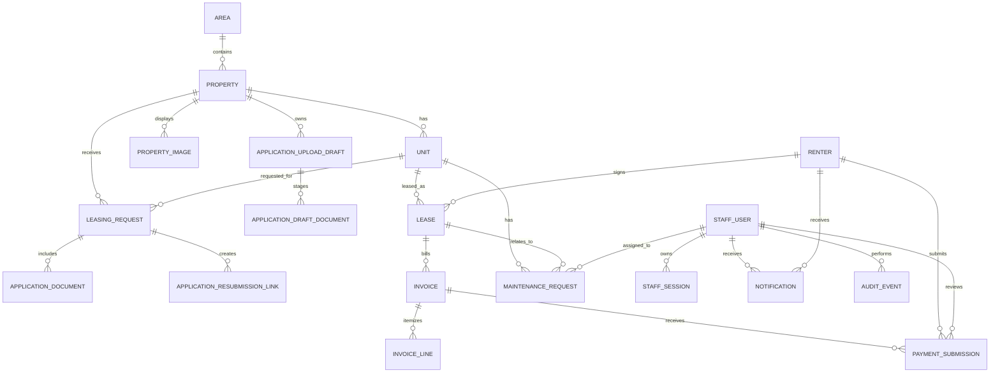

# RRC Leasing — Next.js Implementation and Database Relationship Plan

## Purpose

This plan converts the RRC interface to **Next.js + Tailwind CSS** while retaining the existing **Node.js Fastify API, Prisma, and PostgreSQL**. The immediate goal is a stable application form and staff workspace without data loss or a risky production database rewrite.

## Architecture

```text
Next.js + Tailwind UI
  ├─ routes and renderers
  ├─ feature actions
  └─ feature services
          │ HTTPS / JSON
          ▼
Fastify Node.js API
  ├─ routes
  ├─ actions
  ├─ services
  ├─ repositories
  └─ Prisma
          │
          ▼
PostgreSQL
```

### Responsibility rules

| Layer | Responsibility | Must not do |
|---|---|---|
| Next.js renderer | Display data, loading/empty/error states, accessible interactions | Query Prisma or send mail directly |
| Next.js action | Validate browser intent and call the API | Contain database rules |
| API route | Parse HTTP, authenticate, select action, return response | Perform database work inline |
| API action | Authorize and coordinate one operation | Render HTML |
| API service | Transactions, mail, notifications, document rules | Read request objects directly |
| Repository | Prisma reads/writes only | Send mail or decide permissions |

## Feature implementation plan

### 1. Foundation

- Create `apps/web` with Next.js App Router, TypeScript, Tailwind CSS, ESLint, Vitest, and Playwright.
- Add shared Zod request/response contracts in `packages/contracts`.
- Define RRC Tailwind tokens for navy, gold, neutral surfaces, text, error, success, focus rings, spacing, radius, and shadows.
- Add one API client that attaches credentials, handles typed errors, and never exposes database credentials to the browser.
- Preserve Fastify and Prisma as the API/data layer.

### 2. Public leasing experience

- Create SSR routes for home, commercial listings, residential listings, property details, and how-to-apply.
- Use client components only for interactive controls: filters, viewing request modal, application stepper, file uploader, and final review dialog.
- Replace hash routes with normal URLs:
  - `/properties/[reference]`
  - `/apply/[reference]`
  - `/resubmit/[token]`
- Show predictable loading, empty, error, and success renderers for every data fetch.

### 3. Stable application workflow

- One React component per step: lease, applicant, requirements, documents, review.
- Keep field state inside the mounted form; typing must never rerender the full form or scroll the page.
- Persist a draft when the user changes step, leaves the page, or completes an upload—not on every keystroke.
- Upload each document independently and retain the returned document ID in the draft.
- Present file name, kind, size, upload state, retry, and remove controls.
- On final submit, require the API receipt to return the exact saved document count.
- Render a receipt with request reference, next step, and verified attachment count.

### 4. Staff workspace

- Build protected `/admin` routes with a single leasing queue.
- Each request uses sections: Overview, Applicant details, Attachments, Activity, and Request documents.
- Staff actions are explicit commands: start review, schedule, approve, decline, close, request missing documents, and resend notification.
- Each command produces an activity event and returns a focused UI update instead of a whole-page reload.

### 5. API refactor order

Refactor one API feature at a time without changing its public behavior:

```text
platform/src/
  routes/
    leasing-request-routes.ts
  actions/
    submit-application.ts
    create-viewing-request.ts
    request-resubmission.ts
    update-request-status.ts
  services/
    application-service.ts
    document-service.ts
    notification-service.ts
    operational-mail-service.ts
  repositories/
    leasing-request-repository.ts
    property-repository.ts
    document-repository.ts
  schemas/
    leasing-request-schema.ts
```

## Current database relationship map

The following is the real current Prisma model structure. Keep it intact during the Next.js frontend migration.



## Database domains

| Domain | Current models | Purpose |
|---|---|---|
| Staff access | `StaffUser`, `StaffSession`, `AuditEvent` | Authentication, role control, traceability |
| Property catalogue | `Area`, `Property`, `Unit`, `PropertyImage` | Public listings and availability |
| Leasing intake | `LeasingRequest`, `ApplicationDocument`, `ApplicationResubmissionLink` | Viewings, applications, documents, resubmission workflow |
| Upload safety | `ApplicationUploadDraft`, `ApplicationDraftDocument` | Temporary document staging before final application submission |
| Tenant operations | `Renter`, `Lease`, `Invoice`, `InvoiceLine`, `PaymentSubmission`, `MaintenanceRequest` | Future renter/lease/billing/maintenance workflows |
| Communication | `Notification` | Staff/renter inbox, action links, read status |

## Key relationships and deletion rules

| Parent | Child | Relationship and protection |
|---|---|---|
| `Area` | `Property` | One area has many properties. Area deletion is restricted while properties exist. |
| `Property` | `Unit` | One property has many units. Property deletion is restricted while units exist. |
| `Property` | `PropertyImage` | A property owns many images. Delete images when property is deleted. |
| `Property` / `Unit` | `LeasingRequest` | Requests retain their source property/unit. Delete is restricted to protect history. |
| `LeasingRequest` | `ApplicationDocument` | One application/request has many documents. Documents delete with the request. |
| `LeasingRequest` | `ApplicationResubmissionLink` | One request can have many time-limited resubmission links. Links delete with the request. |
| `ApplicationUploadDraft` | `ApplicationDraftDocument` | A temporary upload session owns staged documents. Both are deleted after final submission or expiry cleanup. |
| `Unit` / `Renter` | `Lease` | A lease belongs to one unit and one renter. Both are protected from accidental deletion. |
| `Lease` | `Invoice` | One lease has many invoices. Invoices are protected from accidental lease deletion. |
| `Invoice` | `InvoiceLine` | Invoice lines delete with the invoice. |
| `Invoice` / `Renter` | `PaymentSubmission` | A payment belongs to one invoice and one renter; optional staff review is retained. |

## Current intake flow

```text
Applicant selects property
  → application draft is created
  → documents are uploaded to ApplicationDraftDocument
  → final application creates LeasingRequest
  → documents copy to ApplicationDocument in one transaction
  → upload draft is deleted
  → Notification and email are sent
```

This transaction is the protection that prevents an application from referring to document IDs that were not saved.

## Database migration plan

### Phase A — No schema change during frontend migration

- Keep all existing Prisma models and PostgreSQL tables.
- Keep the current migrations as the source of truth.
- Add automated API tests before moving each UI workflow.
- Back up PostgreSQL before staging and before public cutover.

### Phase B — Normalize workflow history after Next.js is stable

Add the following only when the staff workflow is confirmed. These are planned models, not immediate changes.

| Proposed model | Why it is needed |
|---|---|
| `LeasingRequestEvent` | Immutable timeline for status changes, resubmission requests, document uploads, and email outcomes. |
| `DocumentRequirement` | Structured requested-document items instead of keeping the requested list only as JSON on a link. |
| `DocumentStorage` | Storage key, size, SHA-256 fingerprint, antivirus status, and retention date when moving documents out of PostgreSQL bytes. |
| `LeasingAssignment` | Explicit ownership of an application by a leasing staff member. |
| `EmailDelivery` | Message type, recipient, provider response, timestamps, and retry state without exposing message credentials. |

### Phase C — Private object storage (separate hardening project)

- Move large images and application documents from `Bytes` fields to private object storage.
- Store only `storageKey`, MIME type, size, checksum, and scan status in PostgreSQL.
- Serve files through authenticated, expiring download routes—never public filesystem paths.
- Migrate historical documents in batches and verify every checksum before deleting database copies.

## Required indexes

The current schema already includes the essential request, status, property, unit, and notification indexes. Before a public increase in traffic, add or verify:

- `LeasingRequest(status, requestedAt DESC)` for the staff queue;
- `ApplicationDocument(requestId, submittedAt DESC)` for attachments;
- `ApplicationResubmissionLink(requestId, expiresAt)` for expiry cleanup;
- `Notification(staffUserId, status, createdAt DESC)` for the admin bell;
- `ApplicationUploadDraft(expiresAt)` for scheduled removal of expired uploads.

## Security and data rules

- Never put database URLs, SMTP credentials, Prisma access, or document bytes in Next.js browser code.
- Use role checks in API actions; UI visibility alone is not authorization.
- Store only token hashes for staff sessions and secure resubmission links.
- Keep application documents private and return them only through authenticated staff or token-scoped routes.
- Validate type, file size, filename, and file signature before persisting uploads.
- Add retention/deletion rules for rejected applications and expired upload drafts before collecting high volumes of personal documents.
- Log metadata and outcomes, never passwords, full document content, or email secrets.

## Acceptance criteria

- Existing PostgreSQL data remains readable before and after the Next.js cutover.
- Every Next.js screen uses a typed API contract.
- No browser request can access Prisma or bypass API authorization.
- A submitted application either records all verified documents or returns a clear, recoverable error.
- Staff can see the documents, request missing ones, and view lifecycle activity from one request detail screen.
- Rollback restores the old frontend while leaving the API and database unchanged.
